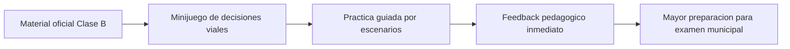
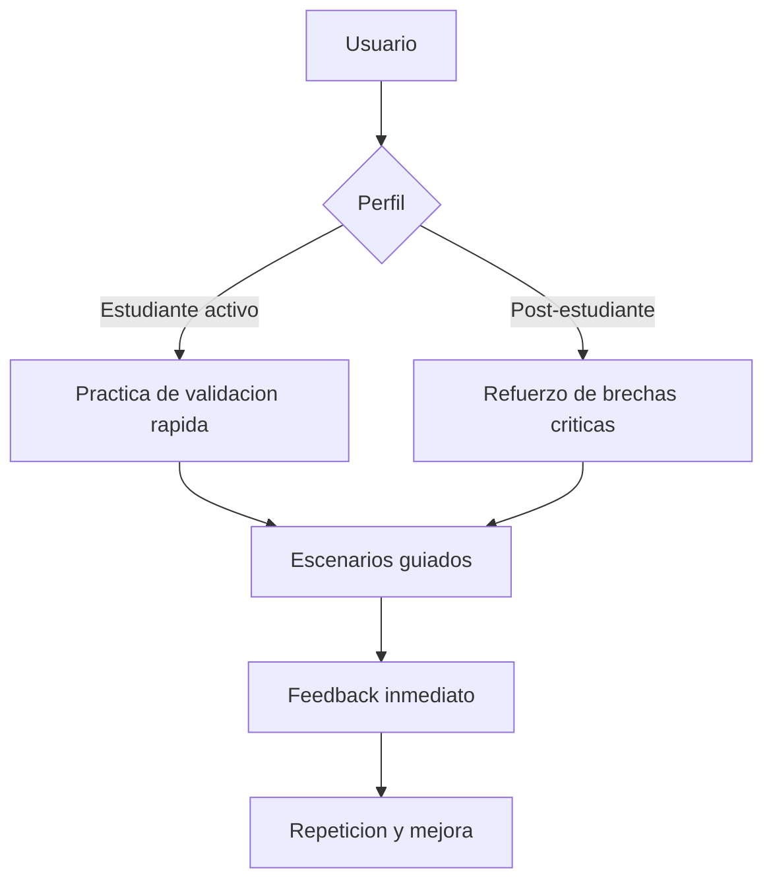
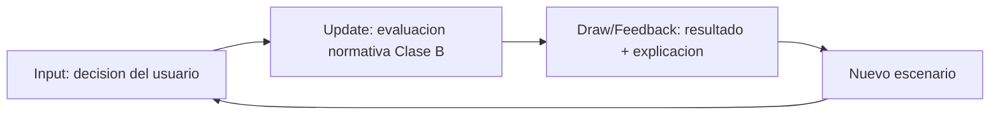
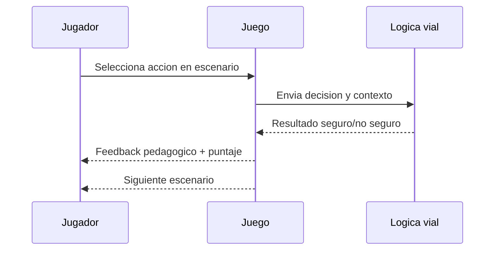
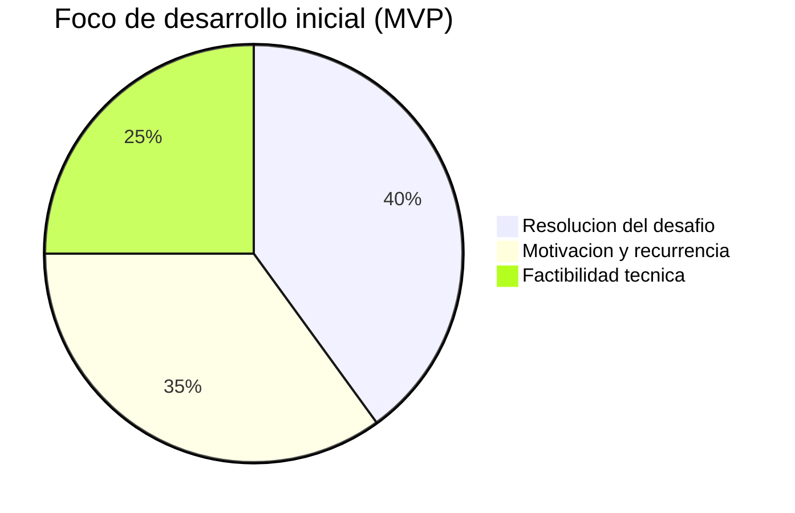

Este documento detalla la propuesta para el proyecto **Safe Mobility 4 All & 4 Life**, desarrollado en el marco del concurso organizado por el Automóvil Club de Chile y la Universidad Finis Terrae.

## Vista General del Proyecto

## 1. Objetivo del Proyecto
El propósito es facilitar la práctica y comprensión de los contenidos de conducción mediante experiencias digitales interactivas. El juego busca transformar el material oficial del "Libro para la Conducción en Chile Clase B" en un entorno de entrenamiento dinámico.

## 2. Público Objetivo
El diseño está orientado específicamente a:
* **Estudiantes activos:** Personas que están cursando el nivel teórico y necesitan validar lo aprendido.
* **Post-estudiantes:** Usuarios que ya leyeron el libro o realizaron el curso y buscan reforzar conocimientos críticos antes del examen municipal, evitando el aprendizaje puramente memorístico.

### Flujo de Usuario por Perfil

## 3. Idea y Concepto del Juego
El prototipo es un **entrenador de decisiones viales**. A diferencia de una lectura pasiva, el juego sitúa al usuario en escenarios de la vida real donde debe aplicar conceptos de seguridad vial, enfocándose en las brechas y dificultades identificadas en el proceso de aprendizaje teórico.

## 4. Arquitectura del Game Loop (Ciclo de Juego)
Para garantizar un alto potencial de *engagement* y reducir la carga cognitiva, el juego utiliza el siguiente ciclo:

* **Entrada (Input):** El usuario percibe una situación vial basada en los contenidos del curso (ej. una intersección o un cambio de condiciones climáticas).
* **Actualización (Update):** El sistema procesa la lógica según la normativa Clase B, evaluando la factibilidad y seguridad de la respuesta del usuario.
* **Renderizado (Draw/Feedback):** La aplicación muestra el desenlace de la acción y entrega un refuerzo pedagógico basado en los resultados de focus groups sobre aprendizaje vial.

### Diagrama del Game Loop

### Secuencia de Interaccion

## 5. Especificaciones Técnicas y Alcances
Cumpliendo estrictamente con las bases:
* **Plataforma:** Aplicación móvil accesible para dispositivos de **gama media-baja**.
* **Motor de renderizado:** Implementación con **Three.js** para asegurar compatibilidad WebGL en una amplia variedad de equipos, desde dispositivos antiguos hasta notebooks de mayor gama.
* **Restricciones Técnicas:**
    * No requiere hardware adicional.
    * Sin procesamiento de imágenes en la nube.
    * Sin modo multijugador sincrónico.
* **Diseño:** Se privilegian mecánicas no complejas, con geometrías livianas y lógica local, para asegurar viabilidad de desarrollo y rendimiento estable en hardware heterogéneo.

### Matriz de Cumplimiento Tecnico

| Requisito | Estado | Implementacion |
|---|---|---|
| Mobile-first | Cumple | UI adaptable y controles tactiles |
| Motor 3D accesible | Cumple | Three.js con escena optimizada para WebGL |
| Gama media-baja | Cumple | Escena liviana y mecanicas simples |
| Sin hardware adicional | Cumple | Uso de teclado/touch estandar |
| Sin nube | Cumple | Logica local en cliente |
| Sin multijugador sincronico | Cumple | Experiencia single-player |

## 6. Criterios de Evaluación Cubiertos
* **Grado de resolución:** Integración de contenidos teóricos en mecánicas de práctica.
* **Motivación:** Capacidad de incentivar el interés y uso recurrente mediante desafíos interactivos.
* **Factibilidad:** Arquitectura sencilla alineada con los plazos de ejecución del proyecto (abril a septiembre de 2026).

### Grafica de Prioridades del MVP

